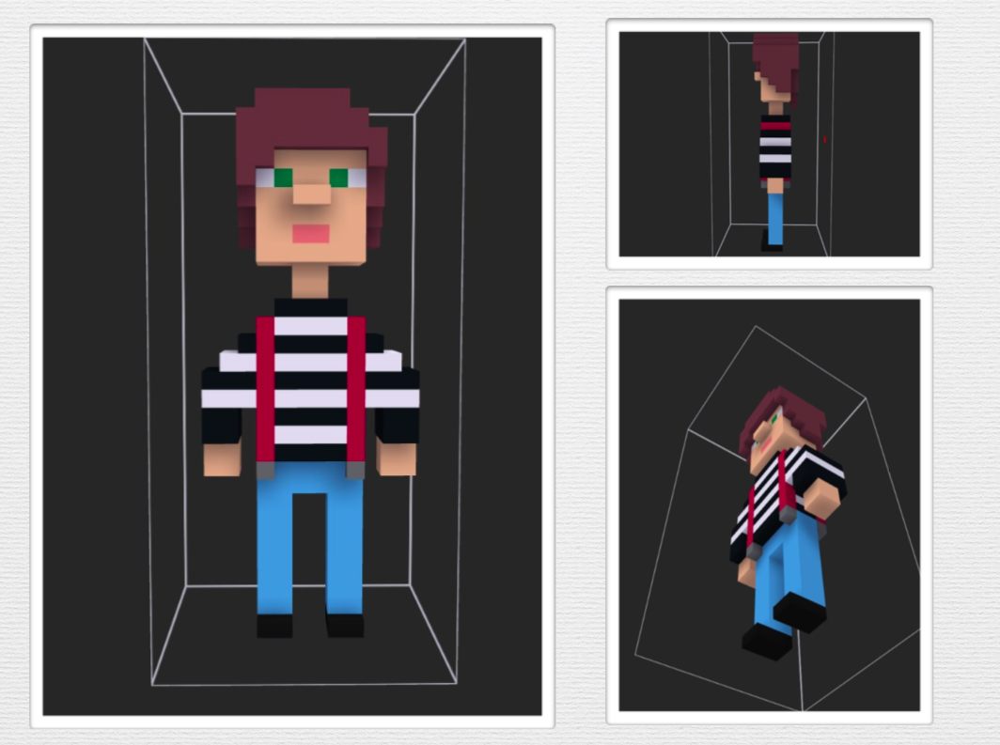

# VR-Game-Unity

This project is a simple virtual reality game consisting of 1 level.

## Game Guide

### Character Guide

You can choose one character. His name is Arte. He has personality disorder and also amnesia. He's a man who lost his journal and doesn't remember anything.

### Beginner’s Guide

The game starts at Arte’s house. The game play VR. The character moves in the direction you are looking. The goal of the game is to find the lost diary. There are also 17 missing pages in the house. If you find the lost pages, you get bonus points.

## Used in Game Design

- Unity
- Magicavoxel
- Mixamo
- Asset Store(Models)

## Check the Video

[Artes's Diary](https://www.youtube.com/watch?v=5EFzQ0-32JQ)
